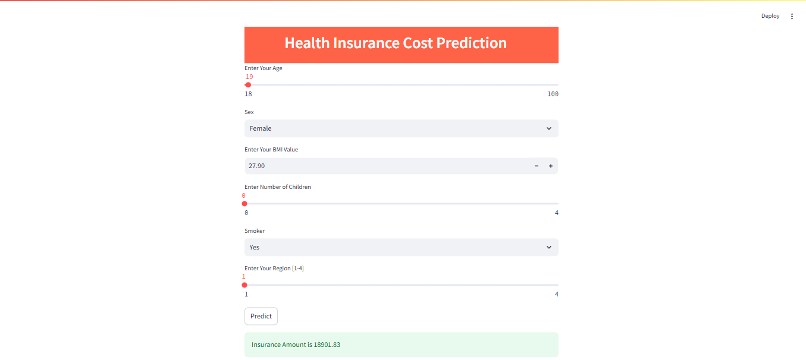

# 🏥 Health Insurance Cost Prediction

### Machine Learning | Python | Streamlit

A machine learning project for predicting individual health insurance costs using customer demographic and health-related attributes. The project covers data preprocessing, exploratory analysis, regression model comparison, evaluation, and an interactive Streamlit application.

## 📌 Project Overview

The objective of this project is to build a machine learning model that predicts medical insurance charges based on:

- 👤 Age
- ⚧️ Sex
- ⚖️ BMI
- 👶 Number of children
- 🚬 Smoking status
- 🌎 Region

Four regression algorithms were trained and compared to identify the best-performing model.

---

## 📊 Dataset

The dataset contains **1,338 records** and **7 variables**.

| Variable | Description |
|---|---|
| `age` | Age of the individual |
| `sex` | Gender |
| `bmi` | Body Mass Index |
| `children` | Number of children |
| `smoker` | Smoking status |
| `region` | Residential region |
| `charges` | Medical insurance charges |

### Dataset Checks

- ✅ Dataset dimensions verified
- ✅ Data types examined
- ✅ Missing values checked
- ✅ Descriptive statistics performed
- ✅ Categorical variables converted to numerical values

---

## 🧹 Data Preprocessing

The following steps were performed using **Pandas** and **Scikit-learn**:

1. Loaded the dataset
2. Performed initial data exploration
3. Checked for missing values
4. Generated descriptive statistics
5. Converted categorical variables into numerical representations
6. Separated features (`X`) and target variable (`y`)
7. Split the dataset into training and testing sets using an **80:20 ratio**

---

## 🤖 Machine Learning Models

Four regression algorithms were trained and evaluated:

| Model | R² Score | MAE |
|---|---:|---:|
| Linear Regression | 0.7833 | 4186.51 |
| Support Vector Regression | -0.0723 | 8592.43 |
| Random Forest Regressor | 0.8635 | 2505.75 |
| **Gradient Boosting Regressor** | **0.8780** | **2447.17** |

### 📈 Best Performing Model

**Gradient Boosting Regressor**

- **R² Score:** 0.8780
- **Mean Absolute Error:** 2447.17

Based on the test-set evaluation, Gradient Boosting achieved the best performance among the four models tested.

---

## 🖥️ Streamlit Application

An interactive Streamlit application was developed to allow users to enter customer information and receive an estimated insurance cost.

### Application Inputs

- Age
- Sex
- BMI
- Number of children
- Smoking status
- Region

### 📷 Application Preview



---

## 🛠️ Technologies Used

| Technology | Purpose |
|---|---|
| 🐍 Python | Programming |
| 🐼 Pandas | Data manipulation |
| 🔢 NumPy | Numerical computing |
| 🤖 Scikit-learn | Machine learning |
| 📊 Matplotlib | Data visualization |
| 💾 Joblib | Model serialization |
| 🖥️ Streamlit | Interactive application |
| 📓 Jupyter Notebook | Model development |

---

## 📁 Project Structure

```text
Health-Insurance-Cost-Prediction/
│
├── Dataset/
│   └── insurance.csv
│
├── Model train and testing.ipynb
├── app.py
├── model_joblib_gr
├── StreamlitUI.png
├── README.md
└── .gitignore

🚀 How to Run
1. Clone the repository
git clone <your-repository-url>
cd health-insurance-cost-prediction
2. Install the required packages
pip install -r requirements.txt
3. Run the Streamlit application
streamlit run app.py
⭐ Key Outcome

The project compared four regression algorithms and identified Gradient Boosting Regressor as the best-performing model based on the test-set results.

R² = 0.8780 | MAE = 2447.17

## 👩‍💻 Project Contribution

Developed the complete machine learning workflow, including data preprocessing, exploratory data analysis, feature transformation, model training, performance evaluation, and deployment of the final Gradient Boosting model through a Streamlit application.
